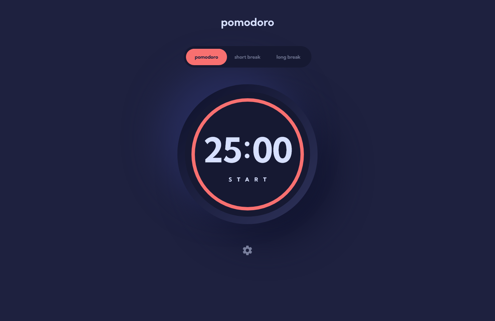

# Frontend Mentor - Pomodoro app solution

This is a solution to the [Pomodoro app challenge on Frontend Mentor](https://www.frontendmentor.io/challenges/pomodoro-app-KBFnycJ6G). Frontend Mentor challenges help you improve your coding skills by building realistic projects. 

## Table of contents

- [Overview](#overview)
  - [The challenge](#the-challenge)
  - [Screenshot](#screenshot)
  - [Links](#links)
- [My process](#my-process)
  - [Built with](#built-with)
  - [Useful resources](#useful-resources)
- [Author](#author)

## Overview

### The challenge

Users should be able to:

- Set a pomodoro timer and short & long break timers
- Customize how long each timer runs for
- See a circular progress bar that updates every minute and represents how far through their timer they are
- Customize the appearance of the app with the ability to set preferences for colors and fonts

### Screenshot

### Links

- Solution URL: [github repo](https://github.com/ZZ83/pomodoro-app)
- Live Site URL: [Live Website](https://zz83.github.io/pomodoro-app/)

## My process

### Built with

- HTML
- CSS 
- Flexbox
- Mobile-first workflow

### Useful resources

- [codepen](https://codepen.io/alvarotrigo/pen/VwMvydQ?editors=1000) - This helped me figuer out how to add the progress bar.
- [w3schools](https://www.w3schools.com/graphics/tryit.asp?filename=trysvg_circle) - This helped me figuer out how to add the progress bar.

## Author

- Frontend Mentor - [ZZ83](https://www.frontendmentor.io/profile/ZZ83)

